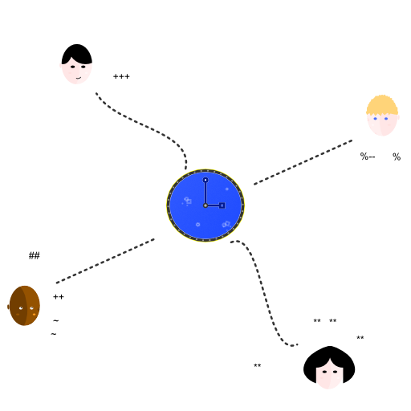

# Hybrid Logical Clock

A [Hybrid Logical Clock](http://muratbuffalo.blogspot.com/2014/07/hybrid-logical-clocks.html) is a resilient and simple distributed clock that provides the ability for identity and ordering of messages in a distributed system.



It is an improvement over [Lamport timestamps](https://en.wikipedia.org/wiki/Lamport_timestamps) and [Vector Clocks](https://en.wikipedia.org/wiki/Vector_clock) and does not need the strong guarantees of [Google’s True Time](http://muratbuffalo.blogspot.com/2013/07/spanner-googles-globally-distributed_4.html).

The Hybrid Logical Clock tolerates NTP kinks and mismatched clocks while still providing excellent behaviour and remaining stable.

## Usage

Get the next id for every new message created:

```js
id = hlc.nxt()
```

When receiving a remote message, update our clock with the remote information:

```js
hlc.recv(remote.id)
```

And that’s it.